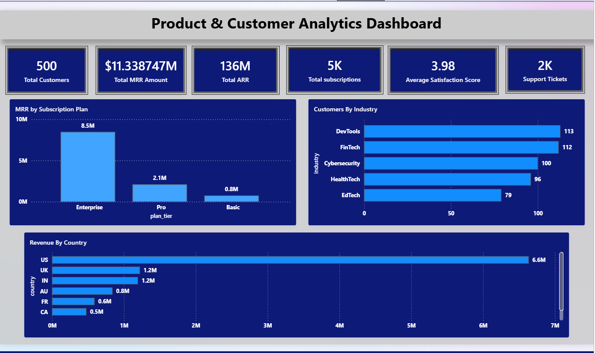
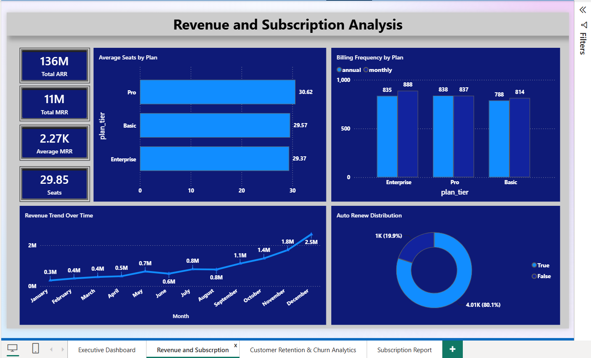
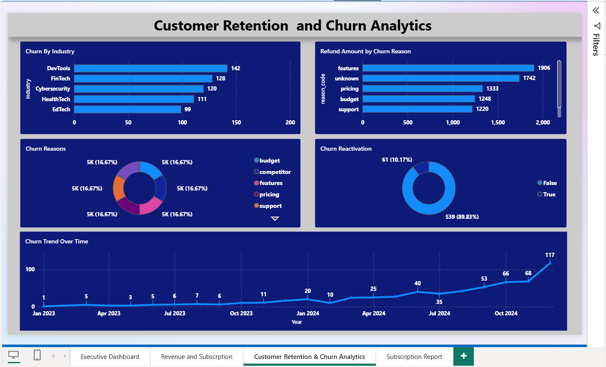
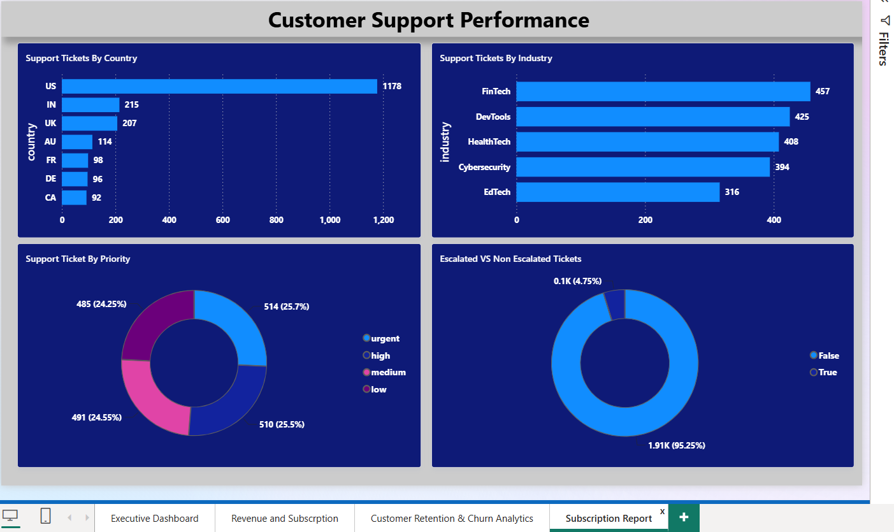

# 📊 Customer Analytics Dashboard

## Project Overview

This project showcases an end-to-end  Customer Analytics solution built using **SQL Server** and **Power BI**. The dashboard analyzes customer subscriptions, revenue, churn, and customer support performance to provide business insights that help stakeholders monitor business health and make data-driven decisions.

## Objectives

- Analyze subscription and revenue performance
- Monitor customer churn and retention
- Evaluate customer support performance
- Create an executive dashboard for business decision-making
- Demonstrate SQL querying and Power BI visualization skills

## Tools & Technologies

- SQL Server
- Power BI Desktop
- Microsoft Excel (CSV Dataset)

## Dataset

The project uses the **RavenStack SaaS** dataset consisting of five related tables:

- Accounts
- Subscriptions
- Feature Usage
- Churn Events
- Support Tickets

## SQL Skills Demonstrated

- INNER JOIN
- LEFT JOIN
- GROUP BY
- Aggregate Functions
- CASE Statements
- Common Table Expressions (CTEs)
- Views
- Foreign Keys
- Data Profiling
- Data Validation

## Power BI Dashboard

The dashboard consists of four interactive pages:

### 1. Executive Overview

Provides a high-level summary of business performance.

- Total Customers
- Monthly Recurring Revenue (MRR)
- Annual Recurring Revenue (ARR)
- Active Subscriptions
- Revenue by Country
- Customers by Industry
- Revenue by Subscription Plan

### 2. Revenue & Subscription Analytics

Focuses on subscription growth and revenue analysis.

- Revenue Trend Overtime 
- Average Seats by Plan
- Billing Frequency by Plan
- Auto Renew Distribution

### 3. Customer Retention & Churn Analytics

Analyzes customer churn and retention.

- Churn by Industry
- Churn Reasons
- Refund Amount by Churn Reason
- Customer Reactivation
- Churn Trend Overtime
  

---

### 4. Customer Support Performance

Monitors customer support operations.

- Support Tickets by Priority
- Support Tickets by Country
- Support Tickets by Industry
- Escalated vs Non-Escalated Tickets

## Data Model

The dashboard follows a **Star Schema** data model.

- **Accounts** is the central table.
- **Accounts** has **one-to-many (1:*)** relationships with:
  - Subscriptions
  - Churn Events
  - Support Tickets
- **Subscriptions** has a **one-to-many (1:*)** relationship with **Feature Usage**.
- These relationships enable cross-table analysis and interactive filtering in Power BI.

## Repository Structure

SaaS_Customer_Analytics_Dashboard
│
├── dataset
├── images
├── sql
├── customer_analytics_dashboard.pbix
└── README.md

## Key Business Insights
- Built an executive dashboard to monitor key SaaS business metrics.
- Analyzed revenue performance across subscription plans and billing frequencies.
- Identified customer churn patterns by industry, country, and churn reason.
- Evaluated customer retention through reactivation analysis and refund trends.
- Monitored support operations using ticket priority, escalation rates, and geographical distribution.
- Designed an interactive four-page Power BI dashboard with slicers and cross-filtering for business users.
